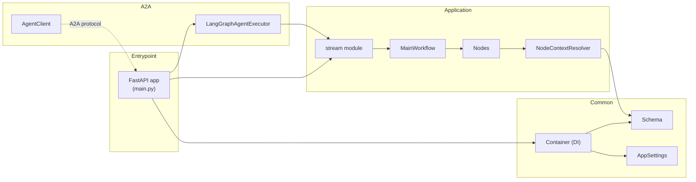
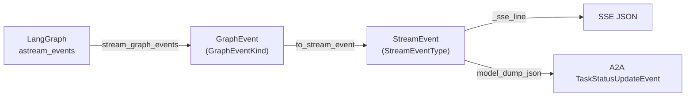
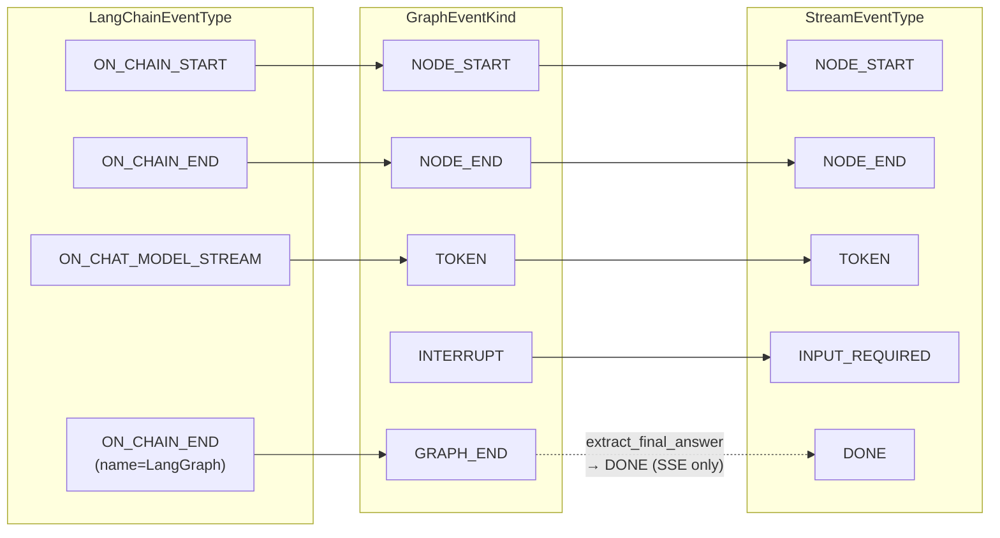
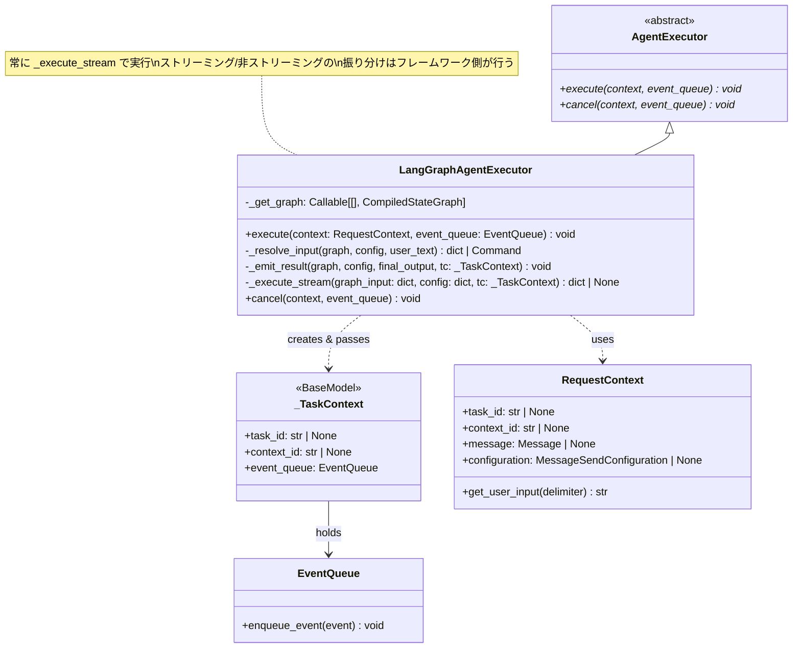
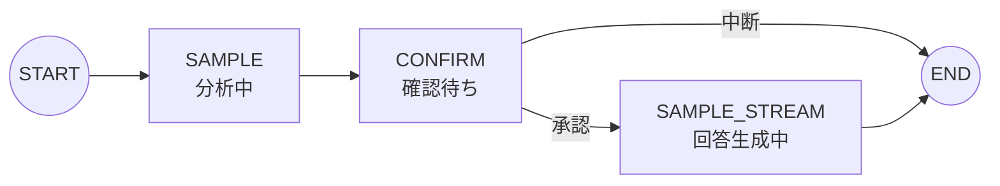
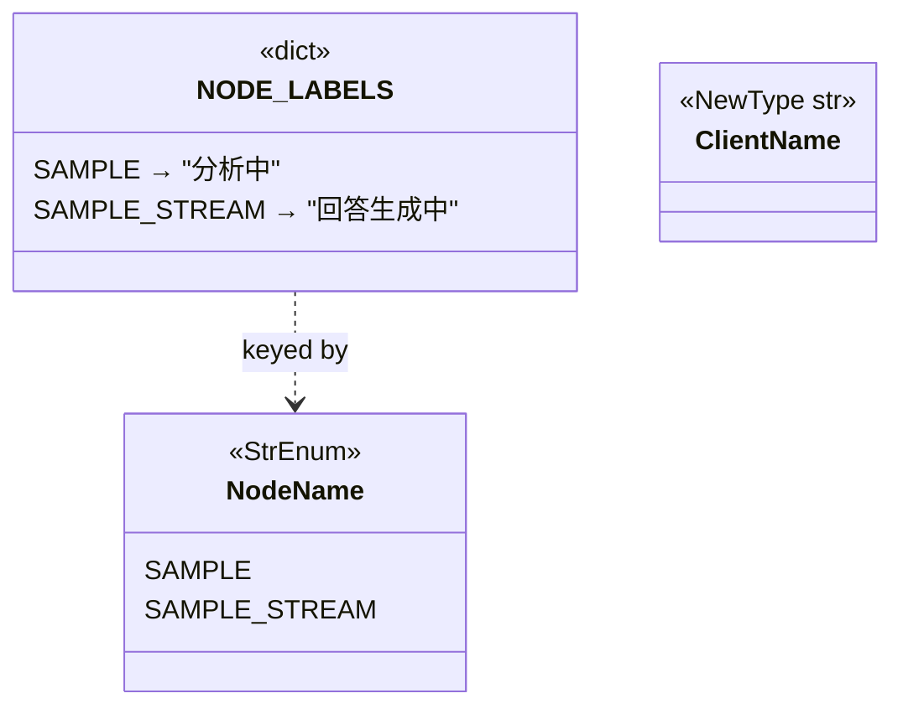
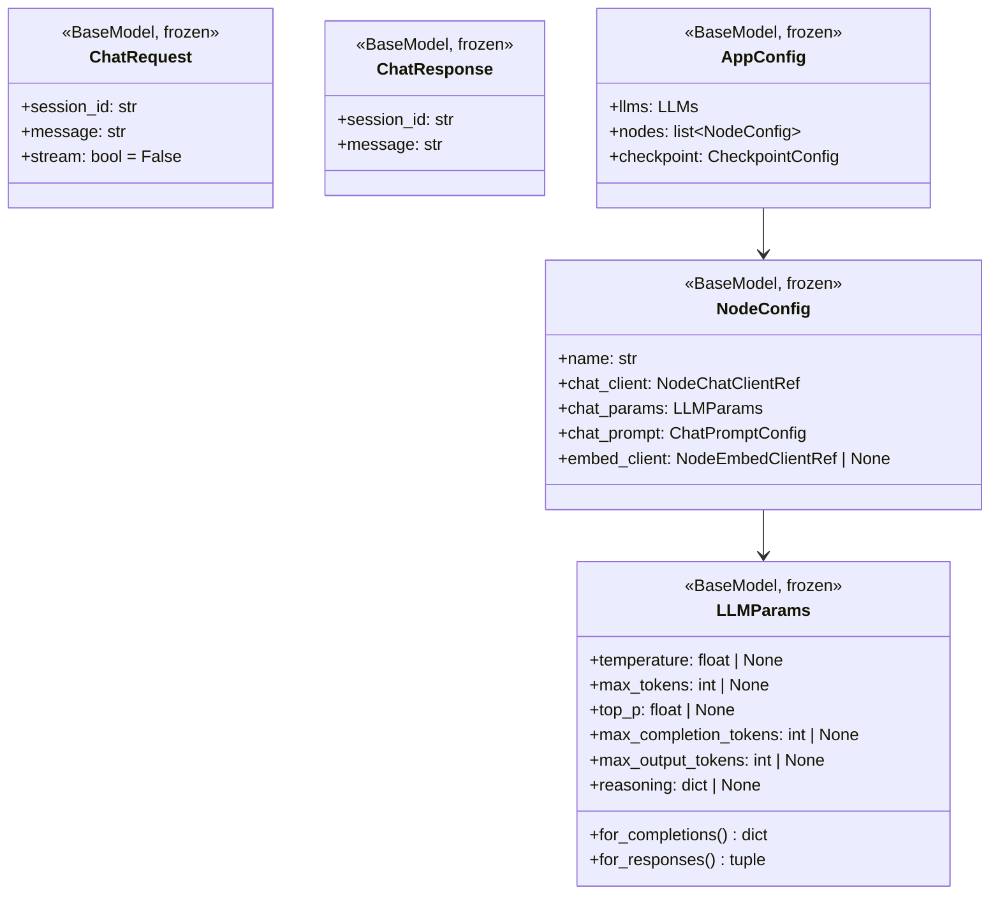
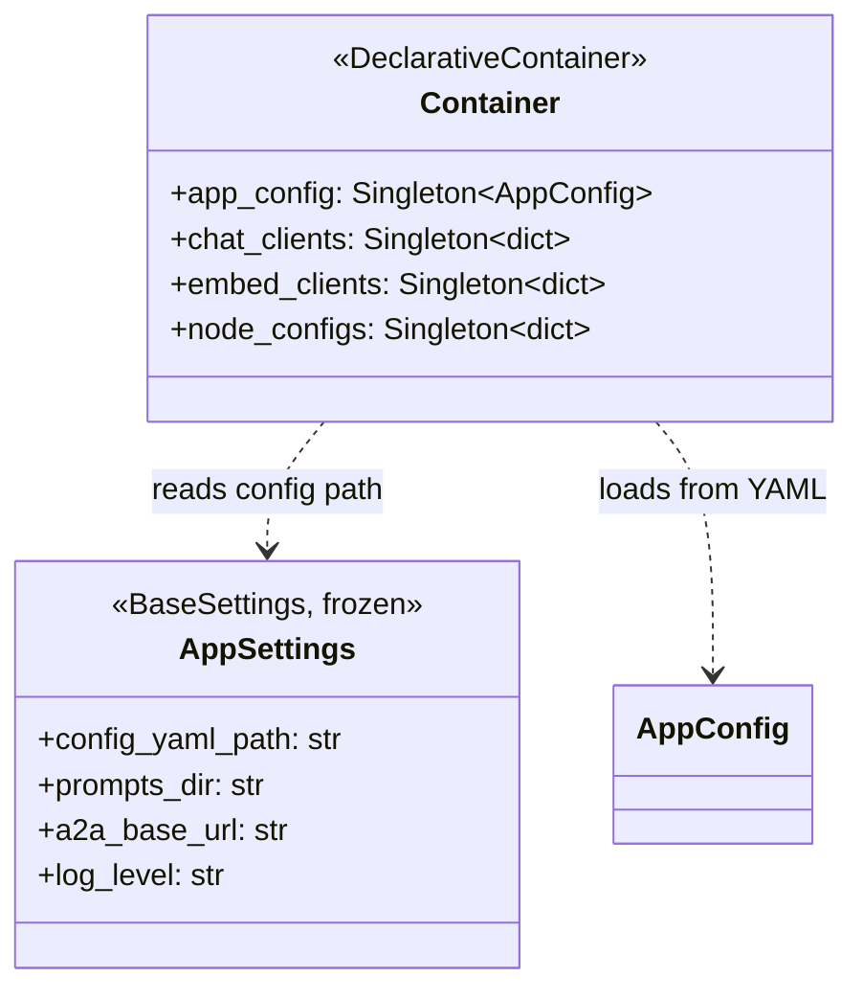

# クラス図

本ドキュメントではシステム全体の構造をクラス図で示す。
各セクションは上流（全体俯瞰）から下流（詳細）の順に並んでいる。

---

## 1. 全体構成

システムは大きく 4 つのレイヤーに分かれる。

- **Entrypoint** — FastAPI アプリケーション。HTTP リクエストの受付と、A2A サーバーのマウントを行う。
- **A2A** — A2A プロトコルによるエージェント間通信。Executor（サーバー側）と AgentClient（クライアント側）で構成される。
- **Application** — ビジネスロジック本体。LangGraph ワークフロー、ノード、ストリーミング共通モジュールを含む。
- **Common** — 設定、スキーマ、DI コンテナなどの共通基盤。



---

## 2. ストリーミング イベント変換フロー

LangGraph の生イベントからクライアントへ届くまでに 3 段階の変換が行われる。
この設計により、LangGraph の仕様変更はストリーミング共通モジュール内で吸収でき、
クライアント向けの `StreamEvent` スキーマは安定して維持できる。

1. **stream_graph_events** — LangGraph の `astream_events` から内部表現 `GraphEvent` を生成
2. **to_stream_event** — `GraphEvent` をクライアント向け `StreamEvent` に変換（マッピングテーブルで一元管理）
3. **プロトコル固有の整形** — SSE の場合は JSON + SSE フォーマット、A2A の場合は `TaskStatusUpdateEvent` のテキストとして送信



---

## 3. イベント型の対応関係

3 つの StrEnum がイベント変換の各段階を型安全に管理する。

- **LangChainEventType** — LangGraph / langchain が返すイベント名。ライブラリ側で型定義がないため本プロジェクトで定義。
- **GraphEventKind** — 本プロジェクト内部のイベント抽象化。プロトコル非依存。
- **StreamEventType** — クライアントへ送信する JSON の `type` フィールド。SSE / A2A 共通。

`GRAPH_END` は内部的にグラフ終了を検知するためのイベントであり、クライアントには直接送信しない。
SSE では代わりに最終回答を `extract_final_answer` で取り出し、`DONE` イベントとして送信する。



---

## 4. A2A Executor

A2A プロトコルの `message/send` と `message/stream` の両方に対応する。
A2A フレームワーク (`a2a` ライブラリ) は `execute()` を呼び出し、
`message/send` の場合は全イベントを集約して最終結果を返し、
`message/stream` の場合はイベントを逐次ストリーミングする。

Executor は常に `_execute_stream` で `astream_events` を使い、思考イベントを含む全イベントを `EventQueue` に送信する。
ストリーミング / 非ストリーミングの振り分けは A2A フレームワーク側が自動的に行う。



---

## 5. A2A イベント生成ヘルパー

Executor が `EventQueue` に送信するイベントを組み立てるファクトリ関数群。
いずれもモジュールレベルの関数で、A2A プロトコルの型 (`TaskStatusUpdateEvent`, `TaskArtifactUpdateEvent`) を生成する。

- **_working_event** — 思考中ステータス (`state=working`, `final=False`)。メッセージ本文に `StreamEvent` の JSON を載せる。
- **_completed_event** — 完了ステータス (`state=completed`, `final=True`)。
- **_artifact_event** — 最終回答を `Artifact` として送信。

```mermaid
classDiagram
    class TaskStatusUpdateEvent {
        +status: TaskStatus
        +final: bool
        +task_id: str
        +context_id: str
    }

    class TaskArtifactUpdateEvent {
        +artifact: Artifact
        +task_id: str
        +context_id: str
    }

    class _working_event {
        <<function>>
        (text, task_id, context_id) → TaskStatusUpdateEvent
    }
    class _completed_event {
        <<function>>
        (task_id, context_id) → TaskStatusUpdateEvent
    }
    class _artifact_event {
        <<function>>
        (text, task_id, context_id) → TaskArtifactUpdateEvent
    }

    _working_event ..> TaskStatusUpdateEvent : creates
    _completed_event ..> TaskStatusUpdateEvent : creates
    _artifact_event ..> TaskArtifactUpdateEvent : creates
```

---

## 6. A2A Client

他の A2A エージェントと通信するためのクライアント。
`async with` でライフサイクルを管理し、内部の httpx セッションを共有する。
A2A プロトコルの生イベントをそのまま yield し、サーバー固有の解釈はこのクラスの責任外。

ユーティリティ関数群 (`text_from_*`) は A2A の `Part` / `Message` / `Artifact` からテキストを抽出する便利関数。

```mermaid
classDiagram
    class AgentClient {
        -_base_url: str
        -_httpx_client: AsyncClient | None
        -_factory: ClientFactory | None
        +__aenter__() Self
        +__aexit__(*args) void
        +stream_events(text: str) AsyncGenerator~Any~
        -_resolve_client() Client
    }

    class text_from_parts {
        <<function>>
        (parts: list~Part~) → str
    }
    class text_from_message {
        <<function>>
        (message: Message) → str
    }
    class text_from_artifact {
        <<function>>
        (artifact: Artifact) → str
    }
```

---

## 7. ストリーミング共通モジュール

`src/application/stream.py` に集約されたストリーミング関連の全型・関数。
API (SSE) と A2A の両パスがこのモジュールを共有することで、イベント仕様の統一を保証する。

主な構成要素:

- **型定義** — `GraphEventKind` (内部), `StreamEventType` (外部), `LangChainEventType` (LangGraph), `GraphEvent` (内部イベント), `StreamEvent` (クライアント向けイベント)
- **変換** — `to_stream_event()` が `GraphEvent` → `StreamEvent` のマッピングを一元管理。マッピングテーブル `_KIND_TO_STREAM_TYPE` で対応関係を定義。
- **ストリーミング** — `stream_graph_events()` が LangGraph の `astream_events` をラップし、`GraphEvent` を yield。内部では `_parse_raw_event()` が生イベント 1 件を `GraphEvent` に変換し、`_yield_interrupt_events()` がグラフ一時停止時の interrupt イベントを生成する。
- **ヘルパー** — `extract_text()` (チャンクからテキスト抽出), `extract_final_answer()` (グラフ出力から最終回答抽出)
- **メタデータ型** — `_EventMetadata` (LangGraph が自動注入する `langgraph_node` キーの TypedDict)

イベント型やマッピングを変更する場合は、このモジュール内の修正だけで SSE / A2A の両方に反映される。

```mermaid
classDiagram
    class GraphEventKind {
        <<StrEnum>>
        NODE_START = "node_start"
        NODE_END = "node_end"
        TOKEN = "token"
        GRAPH_END = "graph_end"
        INTERRUPT = "interrupt"
    }

    class StreamEventType {
        <<StrEnum>>
        NODE_START = "node_start"
        NODE_END = "node_end"
        TOKEN = "token"
        INPUT_REQUIRED = "input_required"
        DONE = "done"
    }

    class LangChainEventType {
        <<StrEnum>>
        ON_CHAIN_START
        ON_CHAIN_STREAM
        ON_CHAIN_END
        ON_CHAT_MODEL_START
        ON_CHAT_MODEL_STREAM
        ON_CHAT_MODEL_END
        ON_LLM_START
        ON_LLM_STREAM
        ON_LLM_END
        ON_PROMPT_START
        ON_PROMPT_STREAM
        ON_PROMPT_END
        ON_RETRIEVER_START
        ON_RETRIEVER_STREAM
        ON_RETRIEVER_END
        ON_TOOL_START
        ON_TOOL_STREAM
        ON_TOOL_END
        ON_TOOL_ERROR
        ON_CUSTOM_EVENT
    }

    class GraphEvent {
        <<dataclass>>
        +kind: GraphEventKind
        +node: str
        +text: str
        +output: dict | None
    }

    class StreamEvent {
        <<BaseModel>>
        +type: StreamEventType
        +node: str | None
        +label: str | None
        +content: str | None
        +session_id: str | None
        +message: str | None
    }

    class _EventMetadata {
        <<TypedDict>>
        +langgraph_node: str
    }

    GraphEvent --> GraphEventKind
    StreamEvent --> StreamEventType

    class to_stream_event {
        <<function>>
        (ev: GraphEvent) → StreamEvent | None
    }
    class stream_graph_events {
        <<function>>
        (graph, graph_input, config) → AsyncIterator~GraphEvent~
    }
    class _parse_raw_event {
        <<function>>
        (event: dict) → GraphEvent | None
    }
    class _yield_interrupt_events {
        <<function>>
        (graph, config) → AsyncIterator~GraphEvent~
    }
    class extract_text {
        <<function>>
        (content: str | list) → str
    }
    class extract_final_answer {
        <<function>>
        (graph_output: dict | None) → str
    }

    to_stream_event ..> GraphEvent : reads
    to_stream_event ..> StreamEvent : creates
    stream_graph_events ..> _parse_raw_event : delegates parsing
    stream_graph_events ..> _yield_interrupt_events : delegates interrupt check
    _parse_raw_event ..> GraphEvent : creates
    _parse_raw_event ..> LangChainEventType : matches
    _parse_raw_event ..> _EventMetadata : reads
    _yield_interrupt_events ..> GraphEvent : yields
```

---

## 8. ワークフロー / ノード

`MainWorkflow` が LangGraph の `StateGraph` を組み立てる。
各ノードは関数として定義され、`NodeContextResolver` 経由で LLM クライアントや設定を受け取る。

- **MainWorkflow** — `build()` でグラフを構築・コンパイルする。ノードの追加 (`_add_nodes`) とエッジの定義 (`_add_edges`) を分離。
- **State** — ワークフロー全体で共有される TypedDict。`chat_history` は `add_messages` リデューサーで累積される。
- **NodeContextResolver** — ノード名から `NodeContext` を引くリゾルバー。起動時に DI コンテナから構築される。
- **NodeContext** — 各ノードに注入される依存関係の束。LLM クライアント、プロンプト、設定を保持する。

```mermaid
classDiagram
    class MainWorkflow {
        +build(resolver: NodeContextResolver, checkpointer) CompiledStateGraph
        -_add_nodes(g: StateGraph, resolver) StateGraph
        -_add_edges(g: StateGraph) StateGraph
    }

    class State {
        <<TypedDict>>
        +last_user_message: str
        +chat_history: list~BaseMessage~
    }

    class NodeContextResolver {
        -_contexts: dict~NodeName, NodeContext~
        +resolve(node_name: NodeName) NodeContext
    }

    class NodeContext {
        <<BaseModel>>
        +chat_client: BaseChatModel
        +embed_client: Embeddings | None
        +node_config: NodeConfig
        +chat_prompt: ChatPromptTemplate
        +structured_output(schema) Runnable
        +stream_chain() Runnable
    }

    class sample {
        <<function>>
        (state: State, context: NodeContext) → dict
    }
    class sample_stream {
        <<function>>
        (state: State, context: NodeContext) → dict
    }

    MainWorkflow ..> NodeContextResolver : uses
    MainWorkflow ..> State : operates on
    sample ..> NodeContext : uses
    sample_stream ..> NodeContext : uses
    NodeContextResolver --> NodeContext : resolves
```

---

## 9. ノードフロー

ワークフローの実行順序。各ノード名の下に `NODE_LABELS` で定義された表示ラベルを併記している。

ユーザーメッセージの `HumanMessage` 変換は `build_graph_input()` がグラフ実行前に行うため、ワークフロー内のノードは LLM 処理に集中する。

- **SAMPLE** — LLM に構造化出力 (Structured Output) で問い合わせ、JSON 形式の応答を得る。
- **CONFIRM** — ユーザーに承認を求める。`interrupt()` でグラフを一時停止し、resume を待つ。中断された場合は END へ遷移する。
- **SAMPLE_STREAM** — LLM の生トークンをストリーミングで出力する。クライアントにはこのノードのトークンが逐次配信される。



---

## 10. 共通型定義

`src/common/defs/types.py` で管理される、プロジェクト全体で参照される型と定数。

- **NodeName** — ワークフロー内のノード名。ワークフロー定義、ストリーミング判定、設定のキーなど各所で使用。
- **NODE_LABELS** — ノード名からクライアント向け表示ラベルへのマッピング。`to_stream_event()` が `StreamEvent.label` に自動付与する。ノード追加時はここにもラベルを追加する。
- **ClientName** — LLM クライアントの名前を表す NewType。DI コンテナでクライアントを名前引きする際に使用。



---

## 11. スキーマ

API リクエスト/レスポンスおよびアプリケーション設定のスキーマ。
すべて `frozen=True` の Pydantic BaseModel で、イミュータブルに管理される。

- **ChatRequest / ChatResponse** — `/test` エンドポイントのリクエスト・レスポンス。`stream` フラグで SSE / JSON を切り替え。
- **NodeConfig** — ノードごとの LLM クライアント参照、パラメータ、プロンプト設定を束ねる。
- **LLMParams** — LLM 呼び出しパラメータ。`for_completions()` / `for_responses()` で API 種別に応じた変換を行う。
- **AppConfig** — YAML から読み込まれるルート設定。LLM 定義、ノード定義、チェックポイント設定を含む。



---

## 12. DI コンテナ

`dependency_injector` ライブラリを使った依存性注入コンテナ。
すべてのプロバイダーは Singleton で、アプリケーション起動時に 1 回だけ初期化される。

起動時の流れ:
1. `AppSettings` から YAML パスを取得
2. YAML を読み込み `AppConfig` を生成
3. `AppConfig` をもとに LLM クライアント群と NodeConfig 群をビルド



---

## 13. FastAPI エントリーポイント

アプリケーションの起点。`lifespan` で DI コンテナの初期化とグラフのビルドを行い、
`app.state.graph` にコンパイル済みグラフを格納する。

2 つのプロトコルを同一プロセスで提供する:
- **`POST /test`** — HTTP API。`stream=true` で SSE、`stream=false` で JSON レスポンス。
- **`/a2a`** — A2A プロトコル。`LangGraphAgentExecutor` を使い、`message/send` と `message/stream` の両方に対応。

```mermaid
classDiagram
    class FastAPI_App {
        <<main.py>>
        +GET /health → dict
        +POST /test → StreamingResponse | ChatResponse
    }

    class _sse_line {
        <<function>>
        (event: StreamEvent) → str
    }
    class _stream_graph {
        <<function>>
        (graph, graph_input, config, session_id) → AsyncGenerator~str~
    }

    FastAPI_App ..> _stream_graph : streaming path
    _stream_graph ..> stream_graph_events : iterates
    _stream_graph ..> to_stream_event : converts
    _stream_graph ..> _sse_line : formats
    FastAPI_App ..> LangGraphAgentExecutor : mounted at /a2a
```
